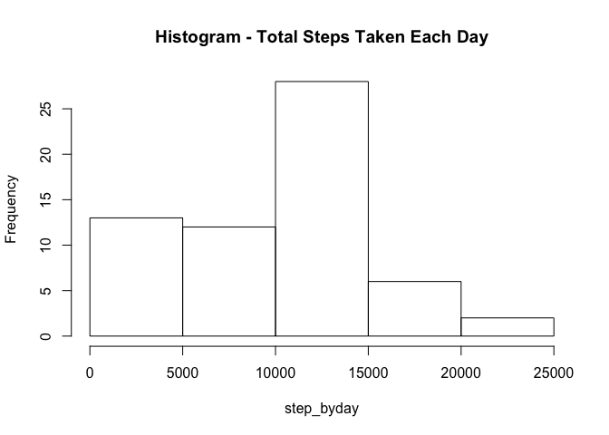
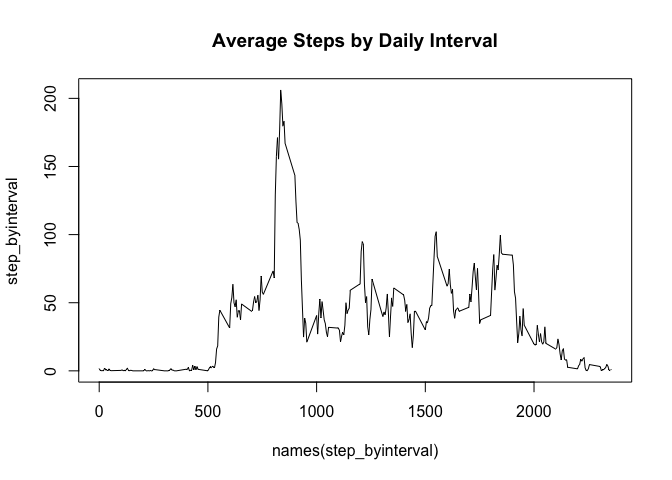
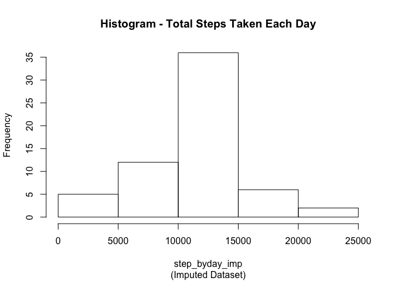
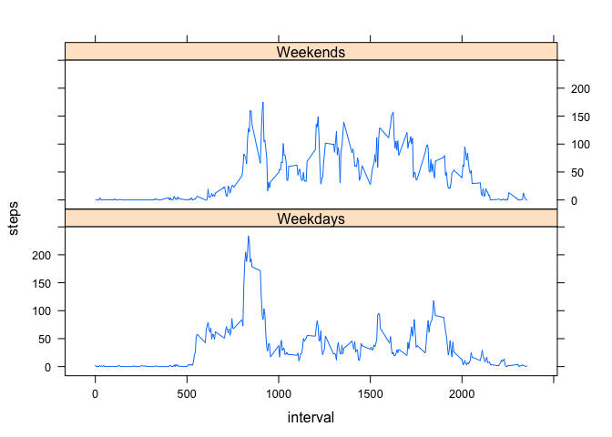

# Reproducible Research: Peer Assessment 1


## Loading and preprocessing the data

The data is in the file "activity.zip". We have first to unzip the file in order to load the data. To read the file without unzip it we have to use the function `unz` in R.


```r
dat <- read.csv(unz('activity.zip','activity.csv'))
head(dat)
```

```
##   steps       date interval
## 1    NA 2012-10-01        0
## 2    NA 2012-10-01        5
## 3    NA 2012-10-01       10
## 4    NA 2012-10-01       15
## 5    NA 2012-10-01       20
## 6    NA 2012-10-01       25
```

## What is mean total number of steps taken per day?

To sum up the total number of steps taken each day:


```r
step_byday <- tapply(dat$steps, dat$date, FUN = sum, na.rm=T)
```

And for the histogram of the total number of steps taken each day:


```r
hist(step_byday, main='Histogram - Total Steps Taken Each Day')
```

 

```r
mean_step <- mean(step_byday)
median_step <- median(step_byday)
```

And the average number of steps is 9354.23, with median number of steps equal 10395.

## What is the average daily activity pattern?

For that we have to compute the average by interval. It is the same structure as in the previous problem, but with the index being the interval:


```r
step_byinterval <- tapply(dat$steps, dat$interval, FUN = mean, na.rm=T)
plot(step_byinterval~names(step_byinterval), main='Average Steps by Daily Interval', type='l')
```

 

And the interval with maximum number of steps is the number 835.


## Imputing missing values

The total number of missing values in the dataset is:


```r
sum(is.na(dat$steps))
```

```
## [1] 2304
```

```r
tapply(dat$steps, dat$date, FUN = f <- function (x) sum(is.na(x)))
```

```
## 2012-10-01 2012-10-02 2012-10-03 2012-10-04 2012-10-05 2012-10-06 
##        288          0          0          0          0          0 
## 2012-10-07 2012-10-08 2012-10-09 2012-10-10 2012-10-11 2012-10-12 
##          0        288          0          0          0          0 
## 2012-10-13 2012-10-14 2012-10-15 2012-10-16 2012-10-17 2012-10-18 
##          0          0          0          0          0          0 
## 2012-10-19 2012-10-20 2012-10-21 2012-10-22 2012-10-23 2012-10-24 
##          0          0          0          0          0          0 
## 2012-10-25 2012-10-26 2012-10-27 2012-10-28 2012-10-29 2012-10-30 
##          0          0          0          0          0          0 
## 2012-10-31 2012-11-01 2012-11-02 2012-11-03 2012-11-04 2012-11-05 
##          0        288          0          0        288          0 
## 2012-11-06 2012-11-07 2012-11-08 2012-11-09 2012-11-10 2012-11-11 
##          0          0          0        288        288          0 
## 2012-11-12 2012-11-13 2012-11-14 2012-11-15 2012-11-16 2012-11-17 
##          0          0        288          0          0          0 
## 2012-11-18 2012-11-19 2012-11-20 2012-11-21 2012-11-22 2012-11-23 
##          0          0          0          0          0          0 
## 2012-11-24 2012-11-25 2012-11-26 2012-11-27 2012-11-28 2012-11-29 
##          0          0          0          0          0          0 
## 2012-11-30 
##        288
```

```r
tapply(dat$steps, dat$interval, FUN = f <- function (x) sum(is.na(x)))
```

```
##    0    5   10   15   20   25   30   35   40   45   50   55  100  105  110 
##    8    8    8    8    8    8    8    8    8    8    8    8    8    8    8 
##  115  120  125  130  135  140  145  150  155  200  205  210  215  220  225 
##    8    8    8    8    8    8    8    8    8    8    8    8    8    8    8 
##  230  235  240  245  250  255  300  305  310  315  320  325  330  335  340 
##    8    8    8    8    8    8    8    8    8    8    8    8    8    8    8 
##  345  350  355  400  405  410  415  420  425  430  435  440  445  450  455 
##    8    8    8    8    8    8    8    8    8    8    8    8    8    8    8 
##  500  505  510  515  520  525  530  535  540  545  550  555  600  605  610 
##    8    8    8    8    8    8    8    8    8    8    8    8    8    8    8 
##  615  620  625  630  635  640  645  650  655  700  705  710  715  720  725 
##    8    8    8    8    8    8    8    8    8    8    8    8    8    8    8 
##  730  735  740  745  750  755  800  805  810  815  820  825  830  835  840 
##    8    8    8    8    8    8    8    8    8    8    8    8    8    8    8 
##  845  850  855  900  905  910  915  920  925  930  935  940  945  950  955 
##    8    8    8    8    8    8    8    8    8    8    8    8    8    8    8 
## 1000 1005 1010 1015 1020 1025 1030 1035 1040 1045 1050 1055 1100 1105 1110 
##    8    8    8    8    8    8    8    8    8    8    8    8    8    8    8 
## 1115 1120 1125 1130 1135 1140 1145 1150 1155 1200 1205 1210 1215 1220 1225 
##    8    8    8    8    8    8    8    8    8    8    8    8    8    8    8 
## 1230 1235 1240 1245 1250 1255 1300 1305 1310 1315 1320 1325 1330 1335 1340 
##    8    8    8    8    8    8    8    8    8    8    8    8    8    8    8 
## 1345 1350 1355 1400 1405 1410 1415 1420 1425 1430 1435 1440 1445 1450 1455 
##    8    8    8    8    8    8    8    8    8    8    8    8    8    8    8 
## 1500 1505 1510 1515 1520 1525 1530 1535 1540 1545 1550 1555 1600 1605 1610 
##    8    8    8    8    8    8    8    8    8    8    8    8    8    8    8 
## 1615 1620 1625 1630 1635 1640 1645 1650 1655 1700 1705 1710 1715 1720 1725 
##    8    8    8    8    8    8    8    8    8    8    8    8    8    8    8 
## 1730 1735 1740 1745 1750 1755 1800 1805 1810 1815 1820 1825 1830 1835 1840 
##    8    8    8    8    8    8    8    8    8    8    8    8    8    8    8 
## 1845 1850 1855 1900 1905 1910 1915 1920 1925 1930 1935 1940 1945 1950 1955 
##    8    8    8    8    8    8    8    8    8    8    8    8    8    8    8 
## 2000 2005 2010 2015 2020 2025 2030 2035 2040 2045 2050 2055 2100 2105 2110 
##    8    8    8    8    8    8    8    8    8    8    8    8    8    8    8 
## 2115 2120 2125 2130 2135 2140 2145 2150 2155 2200 2205 2210 2215 2220 2225 
##    8    8    8    8    8    8    8    8    8    8    8    8    8    8    8 
## 2230 2235 2240 2245 2250 2255 2300 2305 2310 2315 2320 2325 2330 2335 2340 
##    8    8    8    8    8    8    8    8    8    8    8    8    8    8    8 
## 2345 2350 2355 
##    8    8    8
```

And thus, it seems that the missing values are concentrated in some dates in the dataset.

To imput the missing values I use simple the mean of the values in the same interval.


```r
dat_imp <- dat
for (i in 1:dim(dat_imp)[1]) {
  if (is.na(dat_imp$steps[i])) dat_imp$steps[i] = step_byinterval[which(names(step_byinterval)==dat_imp$interval[i])]
}
head(dat_imp)
```

```
##       steps       date interval
## 1 1.7169811 2012-10-01        0
## 2 0.3396226 2012-10-01        5
## 3 0.1320755 2012-10-01       10
## 4 0.1509434 2012-10-01       15
## 5 0.0754717 2012-10-01       20
## 6 2.0943396 2012-10-01       25
```


```r
step_byday_imp <- tapply(dat_imp$steps, dat_imp$date, FUN = sum)
hist(step_byday_imp, 
     main = 'Histogram - Total Steps Taken Each Day',
     sub = '(Imputed Dataset)')
```

 

```r
mean_step_imp <- mean(step_byday_imp)
median_step_imp <- median(step_byday_imp)
```

And the average number of steps is 1.076619\times 10^{4}, with median number of steps equal 1.076619\times 10^{4}. The original values were 9354.23 for the mean and 1.0395\times 10^{4} for the median. One interesting result from the way I imputted here is that the mean and median of the imputed dataset are the same.

## Are there differences in activity patterns between weekdays and weekends?

To investigate that we create the weekdays names in the data, and an indicator for the weekend:


```r
dat$weekd <- weekdays(as.Date(dat$date))
dat$weekend <- as.numeric(dat$weekd=='Sunday')+as.numeric(dat$weekd=='Saturday')
head(dat)
```

```
##   steps       date interval  weekd weekend
## 1    NA 2012-10-01        0 Monday       0
## 2    NA 2012-10-01        5 Monday       0
## 3    NA 2012-10-01       10 Monday       0
## 4    NA 2012-10-01       15 Monday       0
## 5    NA 2012-10-01       20 Monday       0
## 6    NA 2012-10-01       25 Monday       0
```

It looks OK. Now to generate the plot we have to generate the dataset (that can be done more efficiently with *reshape*...):


```r
step_byinterval_week <- data.frame(tapply(dat$steps, list(dat$interval, dat$weekend), FUN = mean, na.rm=T))
dfsteps <- data.frame(interval = as.numeric(row.names(step_byinterval_week)), steps = step_byinterval_week[,1], weekend = 'Weekdays')
dfsteps <- rbind(dfsteps, data.frame(interval = as.numeric(row.names(step_byinterval_week)), steps = step_byinterval_week[,2], weekend = 'Weekends'))
head(dfsteps)
```

```
##   interval     steps  weekend
## 1        0 2.3333333 Weekdays
## 2        5 0.4615385 Weekdays
## 3       10 0.1794872 Weekdays
## 4       15 0.2051282 Weekdays
## 5       20 0.1025641 Weekdays
## 6       25 1.5128205 Weekdays
```

And the plot shows us the following results:


```r
library(lattice)
```

```
## Warning: package 'lattice' was built under R version 3.1.3
```

```r
xyplot(steps~interval|weekend, data = dfsteps, type='l', layout = c(1, 2))
```

 

And it seems that in the weekends the steps are more evenly distributed throughout the day.
